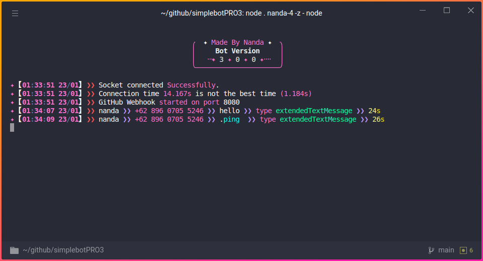

<h2 align="center">
  </br>
  Aestherix</br>
</h2>
<h3 align='center'>
  Next Generation Whatsapp bot built on top of Javascript using <a href="https://github.com/whiskeysockets/baileys">Baileys</a>, and latest version of <a href="https://github.com/nugraizy/aestherix">Aestherix</a> with all-in-one utilities, easy to use, and <i>Blazingly Fast ⚡️</i>
</h3>



# Table of Contents <a name='table'></a>
- [Documentation](./doc/DOC.md#documentations)
- [Pronounciation](#how-is-the-name-written-and-pronounced)
- [Philosophy](#how-is-the-name-written-and-pronounced)
- [Installations](#installations)
  - [linux](./doc/INSTALL.md#linux)
  - [windows](./doc/INSTALL.md#windows)
- [Changelog](./CHANGELOG.md)
- [Run](#run-the-project)
  - [run with flags](#available-flags)
- [Contributors](#contributors)

---

### How is the name written and pronounced?

***Aestherix***. Pronounced [`/ɛsˈθɛrɪks/`](src/media/pronounciation.m4a?raw=true): ES (l**ess**, str**ess**) THEH (e**ther**) RIKS (t**ricks**, b**ricks**).

### Philosophy behind Aestherix:

- **Aesthetics**: Derived from **"Aesthetics"**, representing the appreciation of beauty and form.
- **Ether**: Evoking a sense of the ethereal and intangible.
- ***-ix***: A suffix often associated with innovation, technology, and complexity.

---

# Installations

See: [INSTALL.md](./doc/INSTALL.md)

---

# Run the project

```sh
node . your_session_name --flag
```

you can find the available flags [here](./doc/DOC.md#available-flags)

---
# Contributors

<div align="center">
  <a href="https://github.com/nugraizy" target="_blank" rel="noopener noreferrer" style="text-decoration:none; margin:0 10px; display:inline-block; text-align:center;">
    <br/>
    <sub><b>Nugraizy</b></sub>
  </a>
  <a href="https://github.com/TobyG74" target="_blank" rel="noopener noreferrer" style="text-decoration:none; margin:0 10px; display:inline-block; text-align:center;">
    <br/>
    <sub><b>Tobi Saputra</b></sub>
  </a>
  <a href="https://github.com/xbnfz01" target="_blank" rel="noopener noreferrer" style="text-decoration:none; margin:0 10px; display:inline-block; text-align:center;">
    <br/>
    <sub><b>xbnfz01</b></sub>
  </a>
  <a href="https://github.com/Alphanum404" target="_blank" rel="noopener noreferrer" style="text-decoration:none; margin:0 10px; display:inline-block; text-align:center;">
    <br/>
    <sub><b>Alphanum404</b></sub>
  </a>
</div>
